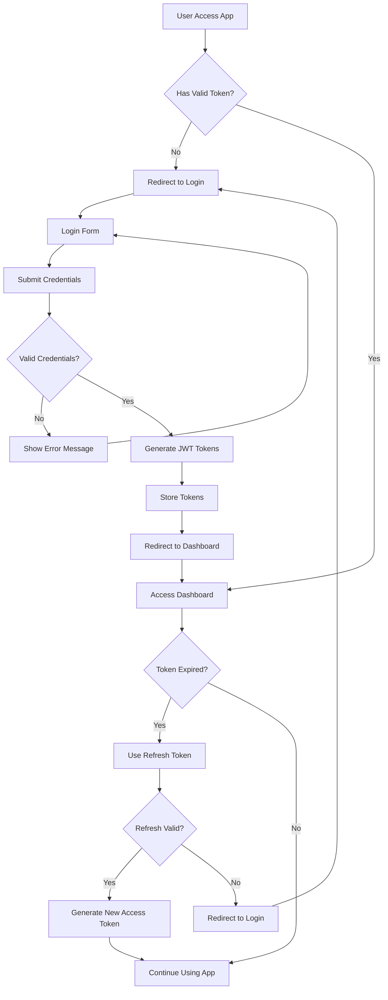

# Flow Implementasi

```mermaid

graph TD
    A[User Access App] --> B{Has Valid Token?}
    B -->|No| C[Redirect to Login]
    B -->|Yes| D[Access Dashboard]

    C --> E[Login Form]
    E --> F[Submit Credentials]
    F --> G{Valid Credentials?}
    G -->|No| H[Show Error Message]
    G -->|Yes| I[Generate JWT Tokens]

    I --> J[Store Tokens]
    J --> K[Redirect to Dashboard]
    K --> D

    D --> L{Token Expired?}
    L -->|Yes| M[Use Refresh Token]
    L -->|No| N[Continue Using App]

    M --> O{Refresh Valid?}
    O -->|Yes| P[Generate New Access Token]
    O -->|No| Q[Redirect to Login]

    P --> N
    H --> E
    Q --> C
    
```
