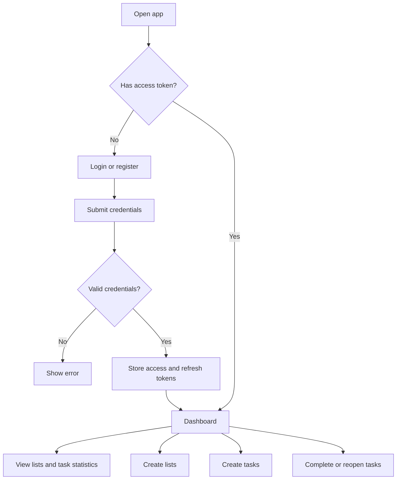

# To-Do Frontend

Next.js frontend for the To-Do List project. It provides a landing page, authentication screens, a dashboard, and local API route handlers for demo task management workflows.

## Stack

- Next.js 14
- React 18
- TypeScript
- Tailwind CSS
- shadcn/ui-style components built on Radix UI primitives
- lucide-react icons
- bcryptjs and jsonwebtoken for local demo auth route handlers

## Project Structure

```text
to-do-fe/
|-- app/
|   |-- api/             # Next.js route handlers for auth, lists, tasks, and health
|   |-- auth/            # Login and registration pages
|   |-- dashboard/       # Authenticated dashboard
|   |-- layout.tsx
|   `-- page.tsx
|-- components/ui/       # Reusable UI components
|-- hooks/
|-- lib/
|-- public/
|-- styles/
|-- package.json
`-- tailwind.config.ts
```

## Installation

```bash
cd to-do-fe
pnpm install
```

If you prefer npm:

```bash
npm install
```

## Run Locally

```bash
pnpm dev
```

Open:

```text
http://localhost:3000
```

## Demo Login

The login page is prefilled with a demo user:

```text
Email: chris-tinaa@example.com
Password: SecurePass123!
```

On successful login, the app stores `accessToken` and `refreshToken` in `localStorage` and redirects to `/dashboard`.

## User Flow



## Local API Routes

The frontend includes route handlers under `app/api`. These are useful for local demos and frontend development.

| Method | Route | Description |
| --- | --- | --- |
| `GET` | `/api/health` | Check app API status |
| `POST` | `/api/auth/register` | Register a user |
| `POST` | `/api/auth/login` | Log in and receive tokens |
| `POST` | `/api/auth/refresh` | Refresh an access token |
| `POST` | `/api/auth/logout` | Log out |
| `GET` | `/api/lists` | List task lists |
| `POST` | `/api/lists` | Create a task list |
| `GET` | `/api/lists/[id]` | Get a task list |
| `PUT` | `/api/lists/[id]` | Update a task list |
| `DELETE` | `/api/lists/[id]` | Delete a task list |
| `GET` | `/api/lists/[id]/tasks` | List tasks in a list |
| `POST` | `/api/lists/[id]/tasks` | Create a task in a list |
| `GET` | `/api/tasks` | List tasks |
| `GET` | `/api/tasks/statistics` | Get task statistics |
| `PATCH` | `/api/tasks/[id]/complete` | Mark a task complete |
| `PATCH` | `/api/tasks/[id]/incomplete` | Mark a task incomplete |

## Commands

```bash
pnpm dev       # Start local development server
pnpm build     # Build for production
pnpm start     # Run the production build
pnpm lint      # Run Next.js linting
```

## Notes

- The local API handlers use mock or in-memory data, so data may reset when the dev server restarts.
- The frontend currently talks to its own `/api/*` routes, not directly to the Express backend in `to-do-api`.
- For production, replace fallback JWT secrets with real environment variables and move persistent data to a real database-backed API.
